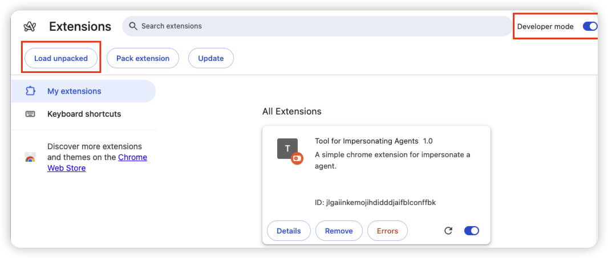

# impersonate agent

## How to use

### Development Mode

1. Clone this repository to your local machine.
2. Run `npm install` to install dependencies.
3. Run `npm run dev` to start development mode.
4. Open the Manage Extensions page in Chrome.
5. Turn on Developer Mode.
6. Click on **Load unpacked** and select the `build/chrome-mv3-dev` directory.
7. You should be able to see this extension (IA - Development) in the list of Chrome extensions.

### Production Mode

1. Clone this repository to your local machine.
2. Run `npm install` to install dependencies.
3. Run `npm run build:prod` to build production version.
4. Open the Manage Extensions page in Chrome.
5. Turn on Developer Mode.
6. Click on **Load unpacked** and select the `build/chrome-mv3` directory.
7. You should be able to see this extension (IA) in the list of Chrome extensions.

### Side-by-side Installation

The development and production versions use different extension IDs, allowing you to have both installed simultaneously:

- **Development**: `impersonate-agents-dev` → "IA - Development" (v1.1.0-dev)
- **Production**: `impersonate-agents` → "IA" (v1.1.0)

This allows you to test new features in the development version while keeping the stable production version installed.

I recommend you pin IA into the bar for quick access.

## Scripts

| Command              | Description                                         |
| -------------------- | --------------------------------------------------- |
| `npm install`        | Install dependencies                                |
| `npm run dev`        | Start development mode (builds development version) |
| `npm run dev:prod`   | Start development mode (builds production version)  |
| `npm run build`      | Build development version                           |
| `npm run build:prod` | Build production version                            |
| `npm run package`    | Package extension for distribution                  |

> Why not public to chrome web store?
>
> - This extension is just for our company developers to use. It's not for public user.
